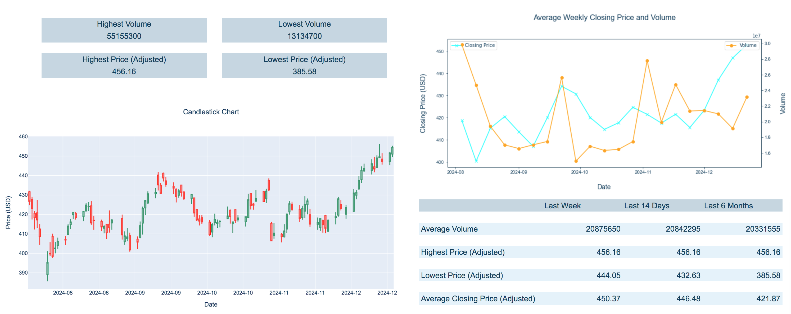

# Microsoft Stock Price Dashboard

## Stock market data from the Marketstack API - retrieved using Python, and analysed using Pandas, MatPlotLib and Plotly.

The [code](https://github.com/Coletterbox/Microsoft-Stock-Price-Dashboard/tree/main#:~:text=Microsoft%20Stock%20Price%20Dashboard.ipynb).

[Dashboard](Dashboard2.png) in progress:

